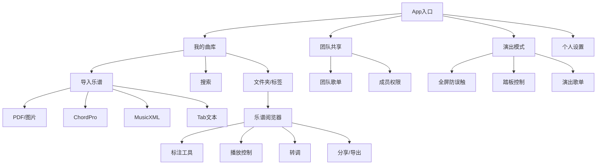

# easysheetmusik
# 产品需求文档：ChordPress

> **产品定位**：面向现代乐手的跨平台智能乐谱管理工具  
> **核心价值**：跨设备同步 + 极致易用的标记翻页 + 智能乐谱解析  
> **当前版本**：V1.0 MVP  
> **目标用户**：教堂敬拜团队、独立乐手、音乐教师  
> **更新日期**：2026-06-19

---

## 一、产品原型图（线框图）

### 1. 信息架构图



### 2. 核心页面线框描述

**页面1：曲库首页**
```
+---------------------------------------+
|  [搜索图标]  我的曲库    [布局切换]   |
+---------------------------------------+
|  [文件夹: 敬拜] [文件夹: 摇滚] ...    |
|  [标签: 本周] [标签: 吉他] ...        |
+---------------------------------------+
|  +-------+  +-------+  +-------+       |
|  | 谱1   |  | 谱2   |  | 谱3   |       |
|  | 封面  |  | 封面  |  | 封面  |       |
|  | 歌名  |  | 歌名  |  | 歌名  |       |
|  +-------+  +-------+  +-------+       |
|  ...                                   |
+---------------------------------------+
|      [+] 大按钮（导入/新建）           |
+---------------------------------------+
```

**页面2：乐谱阅览器（智能解析后）**
```
+---------------------------------------+
| ←返回  [曲目名]  [更多操作]           |
+---------------------------------------+
|                                       |
|     [智能渲染的乐谱区域]              |
|     - PDF: 原始清晰呈现              |
|     - ChordPro: 和弦图+歌词          |
|     - MusicXML: 矢量渲染            |
|                                       |
|  半透明悬浮工具栏：                   |
|  [笔][荧光笔][橡皮擦][播放][转调]    |
|                                       |
+---------------------------------------+
|  [页面指示器] ◉○○○  下一首: 歌名     |
+---------------------------------------+
```

**页面3：演出模式**
```
+---------------------------------------+
|  (全屏沉浸，无任何UI)                |
|                                      |
|        [乐谱内容满屏展示]            |
|                                      |
|  (极暗半透明层，仅在翻页时短暂显示)  |
|  页数: 2/4   下一首: Amazing Grace   |
+---------------------------------------+
退出方式: 三指长按2秒
```

**页面4：和弦谱编辑器（新建ChordPro）**
```
+---------------------------------------+
| ← 返回          保存                  |
+---------------------------------------+
|  标题: [  奇异恩典  ]                |
|  调性: [ G ]  速度: [ 70 ]           |
+---------------------------------------+
|  编辑区 (纯文本+实时预览):           |
|  {title: Amazing Grace}             |
|  [G]Amazing grace, how [C]sweet     |
|  the [G]sound                       |
|  ...                                |
|                                      |
+---------------------------------------+
|  [插入和弦] [转调] [预览] [导入]     |
+---------------------------------------+
```

### 3. 导入流程设计

**智能导入弹窗：**
```
+----------------------------+
|  导入乐谱                  |
+----------------------------+
|  [📄 从文件导入]           |
|  [📷 拍照导入]             |
|  [📋 粘贴文本/链接]        |
|  [🎵 新建ChordPro和弦谱]   |
+----------------------------+
```
- 选择后，系统自动识别格式（PDF/图片/ChordPro/MusicXML/Tab）。
- 识别成功：直接进入乐谱阅览器，展示解析结果。
- 识别失败：提示手动选择格式，或作为普通PDF/图片导入。

### 4. 核心交互说明

- **标注手势**：手指/Pencil直接书写即为标注；双指滑动翻页；通过压力或笔尖触控智能区分书写与翻页。
- **演奏控制**：当导入为MusicXML或ChordPro时，工具栏出现“播放”按钮，可播放音频。播放时乐谱光标跟随。
- **和弦谱转调**：在ChordPro编辑或阅览器中，点击“转调”按钮，弹出转调选择器（上/下半音循环），所有和弦标记实时变化。

---

## 二、乐谱格式支持详解（整合上一轮结论）

### P0 MVP 必做
| 格式 | 核心能力 | 用户价值 |
|---|---|---|
| **PDF** | 高速渲染、无级缩放、标注 | 覆盖90%现有乐谱 |
| **图片** | 相册导入、拍照矫正、清晰化 | 纸质谱、随手拍即用 |
| **ChordPro** | 文本解析、和弦图自动生成、歌词对齐 | 吉他/键盘手核心需求，一键转调是杀手锏 |

### P1 形成专业壁垒
| 格式 | 核心能力 | 用户价值 |
|---|---|---|
| **MusicXML** | 解析与矢量渲染、播放、分谱提取 | 从“读谱”到“懂谱”，专业用户必备 |
| **纯文本Tab** | 解析与显示、自动对齐 | 百万级互联网吉他谱源，零成本导入 |

### P2 生态扩展
| 格式 | 说明 |
|---|---|
| **MuseScore (.mscz)** | 开源格式，社区庞大 |
| **Guitar Pro (.gp)** | 吉他手的“PDF”，需要时集成 |

---

## 三、功能优先级（完整版）

- **P0 (MVP)**：PDF/图片导入与阅览、手写标注、蓝牙踏板翻页、iCloud基础同步、文件夹管理、ChordPro解析与编辑、一键转调。
- **P1 (首发后续)**：MusicXML解析与播放、文本Tab导入、团队共享、演出模式、自动滚动、搜索。
- **P2 (V2.0+)**：MuseScore/GP导入、AI和弦识别（音频转ChordPro）、在线乐谱商店、多轨混音。

---

## 四、完整里程碑路线图

```
M1: 设计验证（Figma原型 + 5名乐手测试）—— 第4周
M2: 核心引擎开发（PDF渲染、标注、ChordPro解析）—— 第10周
M3: MVP内测（TestFlight，iOS首发，iCloud同步）—— 第14周
M4: 优化与首发（App Store美区上架，定价$39.99买断）—— 第18周
M5: 迭代（MusicXML支持、团队功能、安卓筹备）—— 第24周起
```

---

## 五、商业模式

- **免费版**：乐谱上限15首，核心功能（阅览、标注）可用。
- **Pro买断**：$39.99，无限乐谱、云同步、团队共享、智能解析（ChordPro/MusicXML）、新功能。
- **首发策略**：首月$24.99，教育折扣$19.99，教堂5人以上团队优惠。

---

这份文档已可直接交付UI设计师或前端开发，作为原型和需求说明。如需进一步细化某个页面（如乐谱阅览器的全部交互状态），或生成可直接用于Figma/代码的结构化组件清单，可以随时告诉我。
